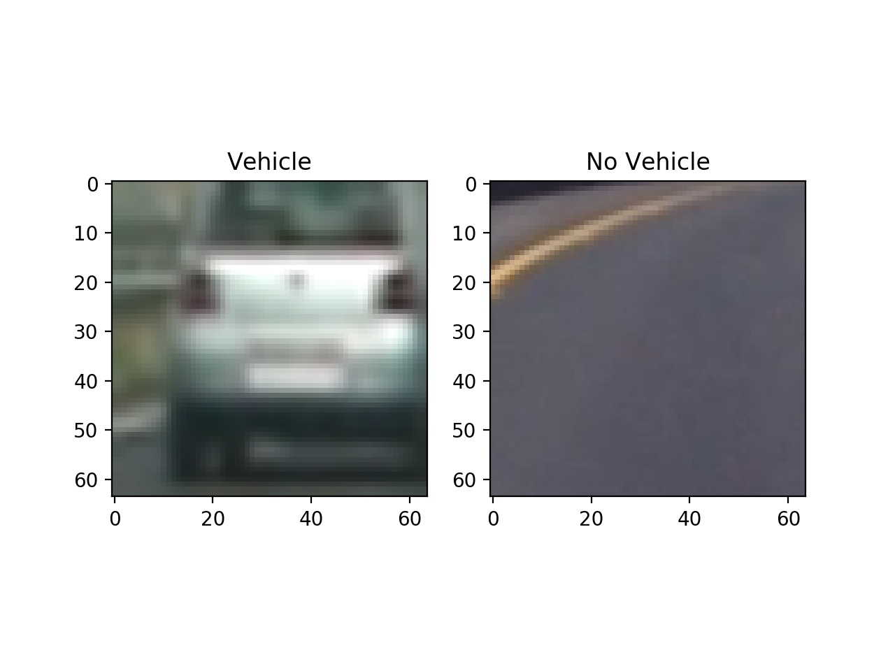
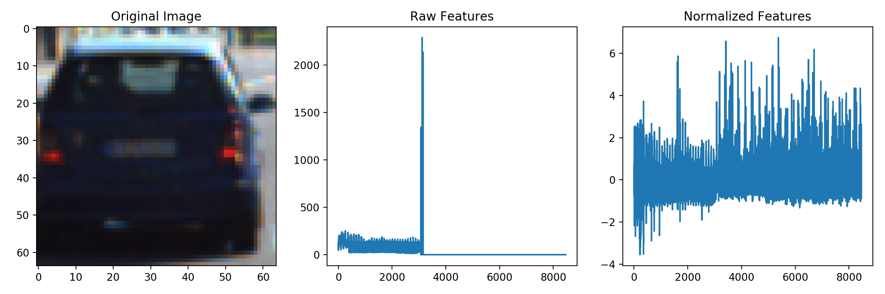

## Vehicle Detection Project

The goals / steps of this project are the following:

* Perform a Histogram of Oriented Gradients (HOG) feature extraction on a labeled training set of images and train a classifier Linear SVM classifier
* Optionally, you can also apply a color transform and append binned color features, as well as histograms of color, to your HOG feature vector. 
* Note: for those first two steps don't forget to normalize your features and randomize a selection for training and testing.
* Implement a sliding-window technique and use your trained classifier to search for vehicles in images.
* Run your pipeline on a video stream (start with the test_video.mp4 and later implement on full project_video.mp4) and create a heat map of recurring detections frame by frame to reject outliers and follow detected vehicles.
* Estimate a bounding box for vehicles detected.

[//]: # (Image References)
[image1]: ./examples/car_not_car.png
[image2]: ./examples/HOG_example.jpg
[image3]: ./examples/sliding_windows.jpg
[image4]: ./examples/sliding_window.jpg
[image5]: ./examples/bboxes_and_heat.png
[image6]: ./examples/labels_map.png
[image7]: ./examples/output_bboxes.png
[video1]: ./project_video.mp4

## [Rubric](https://review.udacity.com/#!/rubrics/513/view) Points

### Here I will consider the rubric points individually and describe how I addressed each point in my implementation.  

---

### Histogram of Oriented Gradients (HOG)

#### 1. Explain how (and identify where in your code) you extracted HOG features from the training images.

The code for feature extraction and SVM training is contained in [train_classifier.py](train_classifier.py).

I started by reading all 8792 vehicle images and 8968 non-vehicle images, Example:



To prevent the different scale from how matplotlib loads JPG images and PNG images I defined a method that loads them
and automatically scales (0..1) floating point values to (0..255) integers:

```python
def read_rgb_image(file):
    """Read RGB image on (0, 256) color scale and uint8 type"""
    image = mpimg.imread(file)
    if np.max(image) <= 1:
        image *= 255
    return np.uint8(image)
```

Also, I defined a function to extract features from the images similar to the Udacity lesson:

```python
def extract_features(images,
                     color_space='RGB',

                     add_spatial_features=True,
                     spatial_size=(32, 32),

                     add_histogram_features=True,
                     histogram_bins=32,

                     add_hog_features=True,
                     hog_orientations=9,
                     hog_pixels_per_cell=8,
                     hog_cells_per_block=2,
                     hog_channel=0
                     ):
    """Extract features from a list of images"""

    features = []

    for file in images:
        file_features = []
        image = read_rgb_image(file)
        image = convert_color(image, color_space=color_space)

        if add_spatial_features:
            file_features.append(bin_spatial(image, size=spatial_size))

        if add_histogram_features:
            file_features.append(color_hist(image, bins=histogram_bins))

        if add_hog_features:
            if hog_channel == 'ALL':
                hog_features = []
                for channel in range(image.shape[2]):
                    hog_features.append(get_hog_features(image[:, :, channel],
                                                         hog_orientations,
                                                         hog_pixels_per_cell,
                                                         hog_cells_per_block,
                                                         visualize=False,
                                                         feature_vector=True))
                hog_features = np.ravel(hog_features)
            else:
                hog_features = get_hog_features(image[:, :, hog_channel],
                                                hog_orientations,
                                                hog_pixels_per_cell,
                                                hog_cells_per_block,
                                                visualize=False,
                                                feature_vector=True)
            file_features.append(hog_features)

        features.append(np.concatenate(file_features))

    return np.array(features)
```

This function can be configured by varying the parameters. By default, it extracts 3 types of features from a list of
images (after applying a color transform):

1. **Spatial**: the image itself in a scaled form
2. **Color Histogram**: The histogram of all color values in an image
3. **HOG**: The histogram of gradients of an image.


#### 2. Explain how you settled on your final choice of color features & HOG parameters.

By using a small `sample_size` and manually selecting only one of the types of features (either spatial, color histogram
or HOG) I tried to vary the parameters. Instead of trusting my human eye to choose which parameters would work better,
I always trained a small `LinearSVC` classifier to see which changes would improve the actual accuracy on the test set.
For that, I chose a train/test split of 80% and 20%.

##### Color Space
For choosing the color space I left all 3 features on - because the color space affects all of them.
After trying out a few, the color space `YUV` improved the test set accuracy best.

##### Spatial

For the `spatial_size` I tried `(16, 16)` as well as `(64, 64)`. The test accuracy decreased for both of them, so I
sticked with the original value of `(32, 32)`.

##### Color histogram

For me, the original value of `histogram_bins = 32` improved the test set accuracy most.

##### HOG

While the variation of `hog_pixels_per_cell = 8` and `hog_cells_per_block = 2` did not improve the classifier, an increase
of `hog_orientations` to `18` or `32` positively affected test accuracy - but negatively impacted the performance.

Also, when I tried out `hog_orientations = 32` on the complete data set this lead to a decreased test set accuracy.
This might have been a result of overfitting the training data. Because of this I reverted my changes and used
`hog_orientations = 9`.

Finally, I altered the `hog_channel` parameter. With the chosen color space `YUV` the test accuracy actually improved when
I used all 3 channels, so I used `hog_channel = 'ALL'`.


#### 3. Describe how you trained a classifier using your selected HOG features.

Before I could use the feature vectors from before, I had to scale & normalize the data:

```python
# normalizing / scaling features
X = np.vstack((vehicles_features, non_vehicles_features)).astype(np.float64)
X_scaler = StandardScaler().fit(X)
X_scaled = X_scaler.transform(X)
```

Here is an image of what the feature vector looks before & after scaling:



First I tried training a `svm.LinearSVC`. Then I shortly tried to implement a neural network with Keras & TensorFlow.

Finally, I tried to fit different SVMs to the data by using `GridSearchCV` like this:
```python
parameters = {'kernel': ('linear', 'rbf'), 'C': [0.001, 0.1, 1, 10]}
svr = svm.SVC()
clf = GridSearchCV(svr, parameters)
clf.fit(X_train, y_train)
print('Best parameters found: {}'.format(clf.best_params_))
```

The best parameters were a LinearSVC with `C=0.001`, so I chose that one to train on a 80/20 train/test split. I achieved
an overall test set accuracy of 99.5%.

To move forward, I stored the classifier and the standard scaler in a file `classifier.p` with pickle.


### Sliding Window Search

#### 1. Describe how (and identify where in your code) you implemented a sliding window search.  How did you decide what scales to search and how much to overlap windows?

I decided to search random window positions at random scales all over the image and came up with this (ok just kidding I didn't actually ;):

![alt text][image3]

#### 2. Show some examples of test images to demonstrate how your pipeline is working.  What did you do to optimize the performance of your classifier?

Ultimately I searched on two scales using YCrCb 3-channel HOG features plus spatially binned color and histograms of color in the feature vector, which provided a nice result.  Here are some example images:

![alt text][image4]

---

### Video Implementation

#### 1. Provide a link to your final video output.  Your pipeline should perform reasonably well on the entire project video (somewhat wobbly or unstable bounding boxes are ok as long as you are identifying the vehicles most of the time with minimal false positives.)

Here's a [link to my video result](./project_video.mp4)


#### 2. Describe how (and identify where in your code) you implemented some kind of filter for false positives and some method for combining overlapping bounding boxes.

I recorded the positions of positive detections in each frame of the video.  From the positive detections I created a heatmap and then thresholded that map to identify vehicle positions.  I then used `scipy.ndimage.measurements.label()` to identify individual blobs in the heatmap.  I then assumed each blob corresponded to a vehicle.  I constructed bounding boxes to cover the area of each blob detected.  

Here's an example result showing the heatmap from a series of frames of video, the result of `scipy.ndimage.measurements.label()` and the bounding boxes then overlaid on the last frame of video:

### Here are six frames and their corresponding heatmaps:

![alt text][image5]

### Here is the output of `scipy.ndimage.measurements.label()` on the integrated heatmap from all six frames:

![alt text][image6]

### Here the resulting bounding boxes are drawn onto the last frame in the series:

![alt text][image7]


---

### Discussion

#### 1. Briefly discuss any problems / issues you faced in your implementation of this project.  Where will your pipeline likely fail?  What could you do to make it more robust?

Here I'll talk about the approach I took, what techniques I used, what worked and why, where the pipeline might fail and how I might improve it if I were going to pursue this project further.  

