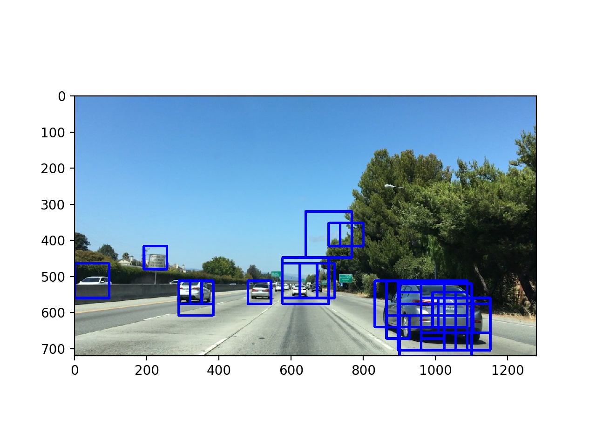
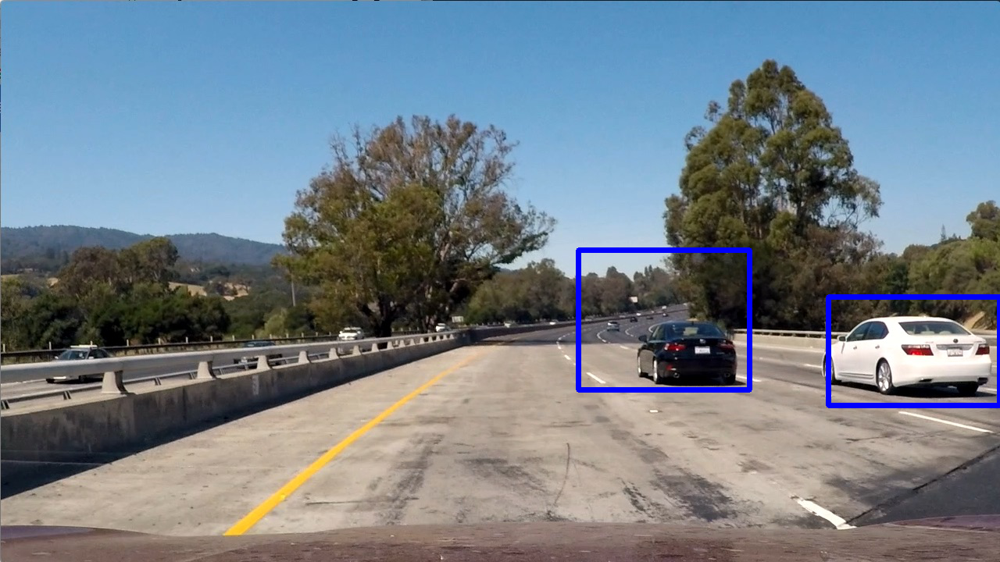
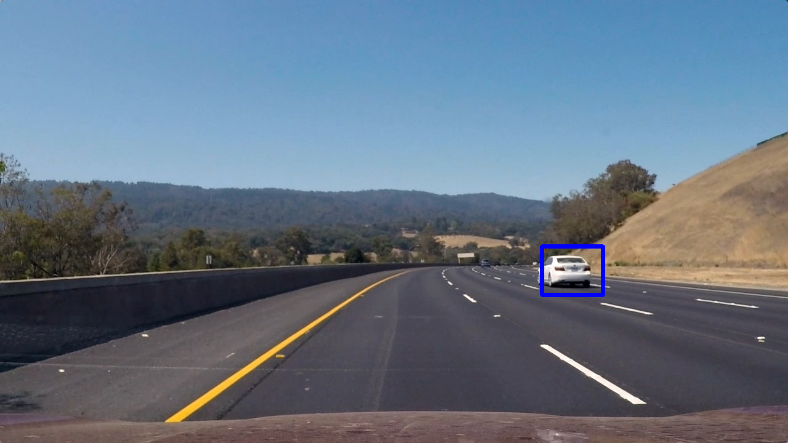
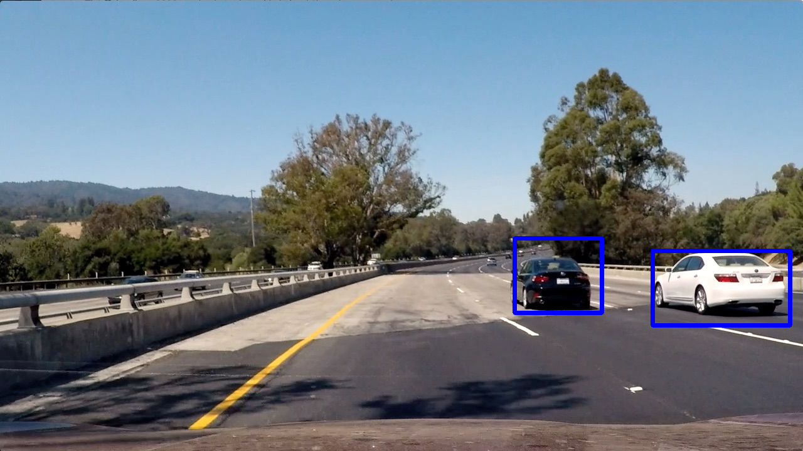
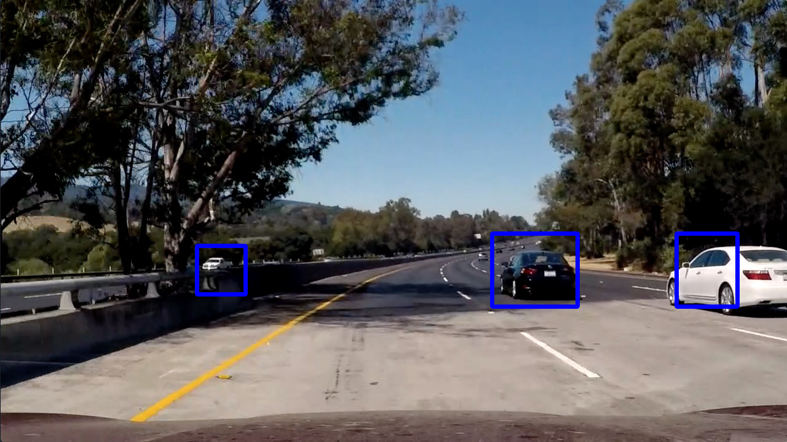

## Vehicle Detection Project

The goals / steps of this project are the following:

* Perform a Histogram of Oriented Gradients (HOG) feature extraction on a labeled training set of images and train a classifier Linear SVM classifier
* Optionally, you can also apply a color transform and append binned color features, as well as histograms of color, to your HOG feature vector. 
* Note: for those first two steps don't forget to normalize your features and randomize a selection for training and testing.
* Implement a sliding-window technique and use your trained classifier to search for vehicles in images.
* Run your pipeline on a video stream (start with the test_video.mp4 and later implement on full project_video.mp4) and create a heat map of recurring detections frame by frame to reject outliers and follow detected vehicles.
* Estimate a bounding box for vehicles detected.

[//]: # (Image References)
[image1]: ./examples/car_not_car.png
[image2]: ./examples/HOG_example.jpg
[image3]: ./examples/sliding_windows.jpg
[image4]: ./examples/sliding_window.jpg
[image5]: ./examples/bboxes_and_heat.png
[image6]: ./examples/labels_map.png
[image7]: ./examples/output_bboxes.png
[video1]: ./project_video.mp4

## [Rubric](https://review.udacity.com/#!/rubrics/513/view) Points

### Here I will consider the rubric points individually and describe how I addressed each point in my implementation.  

---

### Histogram of Oriented Gradients (HOG)

#### 1. Explain how (and identify where in your code) you extracted HOG features from the training images.

The code for feature extraction and SVM training is contained in [train_classifier.py](train_classifier.py).

I started by reading all 8792 vehicle images and 8968 non-vehicle images, Example:


To prevent the different scale from how matplotlib loads JPG images and PNG images I defined a method that loads them
and automatically scales (0..1) floating point values to (0..255) integers:

```python
def read_rgb_image(file):
    """Read RGB image on (0, 256) color scale and uint8 type"""
    image = mpimg.imread(file)
    if np.max(image) <= 1:
        image *= 255
    return np.uint8(image)
```

Also, I defined a function to extract features from the images similar to the Udacity lesson:

```python
def extract_features(images,
                     color_space='RGB',

                     add_spatial_features=True,
                     spatial_size=(32, 32),

                     add_histogram_features=True,
                     histogram_bins=32,

                     add_hog_features=True,
                     hog_orientations=9,
                     hog_pixels_per_cell=8,
                     hog_cells_per_block=2,
                     hog_channel=0
                     ):
    """Extract features from a list of images"""

    features = []

    for file in images:
        file_features = []
        image = read_rgb_image(file)
        image = convert_color(image, color_space=color_space)

        if add_spatial_features:
            file_features.append(bin_spatial(image, size=spatial_size))

        if add_histogram_features:
            file_features.append(color_hist(image, bins=histogram_bins))

        if add_hog_features:
            if hog_channel == 'ALL':
                hog_features = []
                for channel in range(image.shape[2]):
                    hog_features.append(get_hog_features(image[:, :, channel],
                                                         hog_orientations,
                                                         hog_pixels_per_cell,
                                                         hog_cells_per_block,
                                                         visualize=False,
                                                         feature_vector=True))
                hog_features = np.ravel(hog_features)
            else:
                hog_features = get_hog_features(image[:, :, hog_channel],
                                                hog_orientations,
                                                hog_pixels_per_cell,
                                                hog_cells_per_block,
                                                visualize=False,
                                                feature_vector=True)
            file_features.append(hog_features)

        features.append(np.concatenate(file_features))

    return np.array(features)
```

This function can be configured by varying the parameters. By default, it extracts 3 types of features from a list of
images (after applying a color transform):

1. **Spatial**: the image itself in a scaled form
2. **Color Histogram**: The histogram of all color values in an image
3. **HOG**: The histogram of gradients of an image.


#### 2. Explain how you settled on your final choice of color features & HOG parameters.

By using a small `sample_size` and manually selecting only one of the types of features (either spatial, color histogram
or HOG) I tried to vary the parameters. Instead of trusting my human eye to choose which parameters would work better,
I always trained a small `LinearSVC` classifier to see which changes would improve the actual accuracy on the test set.
For that, I chose a train/test split of 80% and 20%.

##### Color Space
For choosing the color space I left all 3 features on - because the color space affects all of them.
After trying out a few, the color space `YUV` improved the test set accuracy best.

##### Spatial

For the `spatial_size` I tried `(16, 16)` as well as `(64, 64)`. The test accuracy decreased for both of them, so I
sticked with the original value of `(32, 32)`.

##### Color histogram

For me, the original value of `histogram_bins = 32` improved the test set accuracy most.

##### HOG

While the variation of `hog_pixels_per_cell = 8` and `hog_cells_per_block = 2` did not improve the classifier, an increase
of `hog_orientations` to `18` or `32` positively affected test accuracy - but negatively impacted the performance.

Also, when I tried out `hog_orientations = 32` on the complete data set this lead to a decreased test set accuracy.
This might have been a result of overfitting the training data. Because of this I reverted my changes and used
`hog_orientations = 9`.

Finally, I altered the `hog_channel` parameter. With the chosen color space `YUV` the test accuracy actually improved when
I used all 3 channels, so I used `hog_channel = 'ALL'`.


#### 3. Describe how you trained a classifier using your selected HOG features.

Before I could use the feature vectors from before, I had to scale & normalize the data:

```python
# normalizing / scaling features
X = np.vstack((vehicles_features, non_vehicles_features)).astype(np.float64)
X_scaler = StandardScaler().fit(X)
X_scaled = X_scaler.transform(X)
```

Here is an image of what the feature vector looks before & after scaling:


First I tried training a `svm.LinearSVC`. Then I shortly tried to implement a neural network with Keras & TensorFlow.

Finally, I tried to fit different SVMs to the data by using `GridSearchCV` like this:
```python
parameters = {'kernel': ('linear', 'rbf'), 'C': [0.001, 0.1, 1, 10]}
svr = svm.SVC()
clf = GridSearchCV(svr, parameters)
clf.fit(X_train, y_train)
print('Best parameters found: {}'.format(clf.best_params_))
```

The best parameters were a LinearSVC with `C=0.001`, so I chose that one to train on a 80/20 train/test split. I achieved
an overall test set accuracy of 99.5%.

To move forward, I stored the classifier and the standard scaler in a file `classifier.p` with pickle.


### Sliding Window Search

#### 1. Describe how (and identify where in your code) you implemented a sliding window search.  How did you decide what scales to search and how much to overlap windows?

The code can be found in the `get_feature_vectors` function in [vehicle_detection.py](vehicle_detection.py).

At first I defined the sliding windows in a separate function, which I later passed on to another function to build the
feature vectors. Then I noticed this might not be the fastest approach. By defining all sliding windows in the same
method as my feature vector creation I could pre-calculate HOG feature vectors and do multiple other steps
(color conversion, scaling) only once for all windows of the same size. Example:

```python
y_min = 320

window_definitions = [
    # window size, x_start, x_end, y_start, y_end
    # [240, None, None, y_min, None],
    [192, 192, None, y_min + 192, None],
    # [128, None, None, y_min, None],
    [80, 160, None, y_min, 560],
    # [64, None, None, y_min, None]
]

# run multiple windows of each definition once - allows us to reuse images for multiple windows
for window_definition in window_definitions:
    window_size, x_start, x_stop, y_start, y_stop = window_definition
    x_start_stop = (x_start, x_stop)
    y_start_stop = (y_start, y_stop)

    # define all windows in one size
    windows = slide_window(image,
                           xy_window=(window_size, window_size),
                           x_start_stop=x_start_stop,
                           y_start_stop=y_start_stop,
                           xy_overlap=xy_overlap)
    all_windows.extend(windows)
```

I decided to ignore the upper 320 pixels of the video because no cars would be detected there. Also I ignored the left
part of the image because the car in the project video was always driving on the left lane.

#### 2. Show some examples of test images to demonstrate how your pipeline is working.  What did you do to optimize the performance of your classifier?

At first I tried to run the same feature vector extraction function as in my [train_classifier.py](train_classifier.py) file.
I was able to get to a visual output pretty quickly:



As you can see, even if my classifier has an accuracy of 99.5% it still detected some false positives.
Also, this approach had the downside that every heavy computation step would be performed on each window - meaning around
500 windows at that time.

To perform better, I had to re-write some code. For example, I did the color conversion only once.
Then, for every window size I used I scaled down the image accordingly (to match the 64x64 training size). I made sure
to only pick window sizes dividable by 8 in order to easily extract HOG features later.

Ultimately I searched on three scales using YUV 3-channel HOG features plus spatially binned color and histograms of color in the feature vector, which provided a nice result.  Here are some example images:











As you can see, the detection works quite well. It even detects some of the cars coming from the other direction.

To improve the performance of my classifier, I only called the HOG function once for each combination of channel &
window size. It was much more costly before when I called the HOG function for every single window.

Still, I could have improved the performance further. For example:

- Currently I call the HOG method for the complete image. But as you can see I do not use the upper part of 320
pixels. This could obviously be improved.
- Also, in my classifier I used all 3 color channels of YUV for creating the HOG features. While this improves the
accuracy of the classifier, it also leads to a negative impact in performance. One HOG channel could be enough.

---

### Video Implementation

#### 1. Provide a link to your final video output. Your pipeline should perform reasonably well on the entire project video (somewhat wobbly or unstable bounding boxes are ok as long as you are identifying the vehicles most of the time with minimal false positives.)

Here's a [link to my video result](./output.mp4).


#### 2. Describe how (and identify where in your code) you implemented some kind of filter for false positives and some method for combining overlapping bounding boxes.

The code can be found in file [vehicle_detection.py](vehicle_detection.py), mostly the class `HeatMapHistory`:

```python
class HeatMapHistory:
    def __init__(self,
                 n=5,  # maximum number of heatmaps to store
                 threshold=10  # threshold of how many heat is needed for a vehicle to be detected (summed up on frames)
                 ):
        self.n = n
        self.threshold = threshold
        self.heatmaps = []

    def append(self, heatmap):
        self.heatmaps.append(heatmap)
        # only store n heatmaps at maximum
        self.heatmaps = self.heatmaps[-self.n:]

    def get_thresholded_heatmap(self):
        heatmap = np.sum(self.heatmaps, axis=0)
        heatmap[heatmap < self.threshold] = 0
        return heatmap
```

I recorded the positions of positive detections in each frame of the video. From the positive detections I created
a heatmap for each frame. I then appended each heatmap to an instance of my `HeatMapHistory` class. There, I summed up
the heatmaps over the last `n` frames. Then I could apply a threshold to get a final heatmap over the last `n` frames.
 
Finally I used `scipy.ndimage.measurements.label()` to identify individual blobs in the heatmap.  I then assumed each
blob corresponded to a vehicle.  I constructed bounding boxes to cover the area of each blob detected.  

Here's an example result showing the heatmap from a series of frames of video, the result of `scipy.ndimage.measurements.label()` and the bounding boxes then overlaid on the last frame of video:

**TODO**

---

### Discussion

#### 1. Briefly discuss any problems / issues you faced in your implementation of this project.  Where will your pipeline likely fail?  What could you do to make it more robust?

I found that choosing which parameters to include in training a classifier was non-trivial. It is not always clear which
of the features will have the best impact, and it involves a lot of trial-and-error. Besides of that, HOG features
seem to have a good impact on the accuracy of the classifier, but come at a very high cost.

Also, I should have built the pipeline to be fast from the beginning. For example, I did not focus on performance when
building the classifier, but instead I focused on the highest accuracy. Therefore I included as many features as I
could. Also, after I built my first sliding window approach I had to start from scratch because I wanted to reuse the
HOG features for each window size. My final approach was to define the sliding windows in the same function as the
feature extraction. That worked much better.

Currently, my pipeline suffers from some problems:

- Performance: As stated before, this could be improved by using less color channels and smaller image parts for HOG
feature extraction.
- Some false positives. Some signs seem to get identified as vehicles. Here I could use the falsely identified images
to retrain my classifier.
- Some vehicles from the opposite direction get detected. This is not an issue per se: these vehicles in the
project video are not a danger because they are separated from the lane our vehicle travels on. On other streets these
detections are desired.
